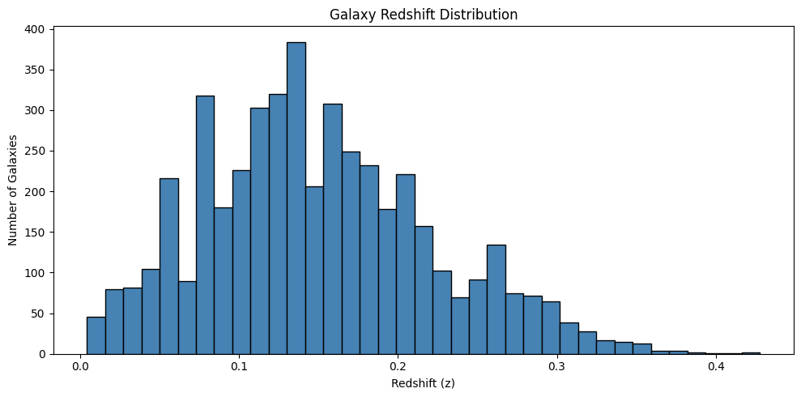
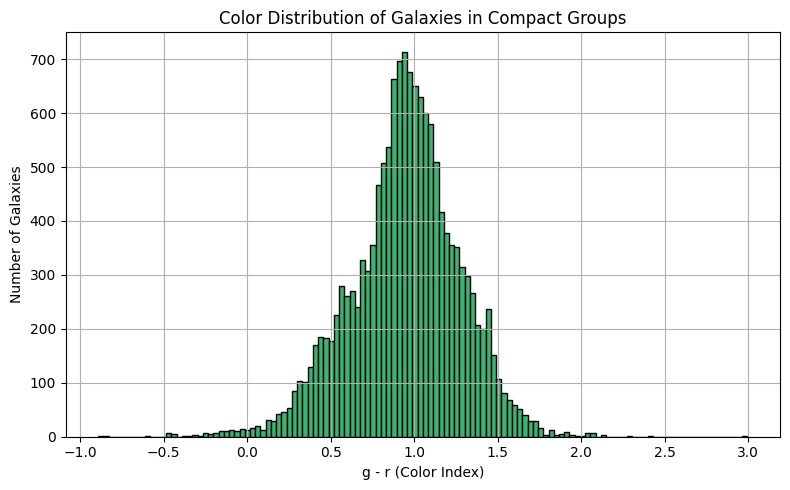
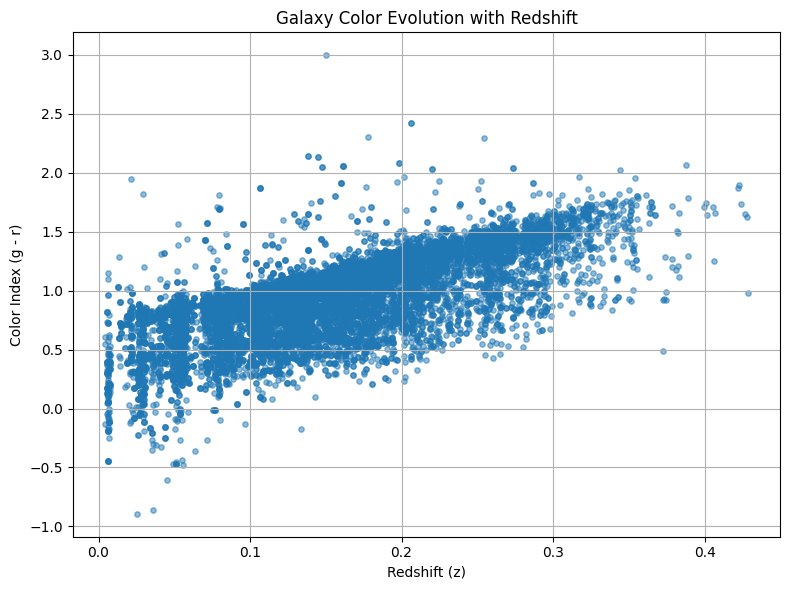
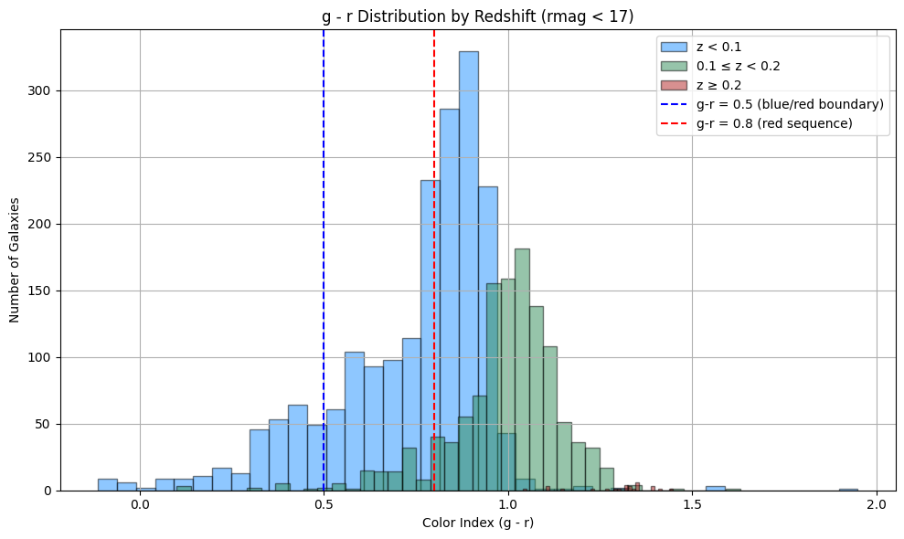
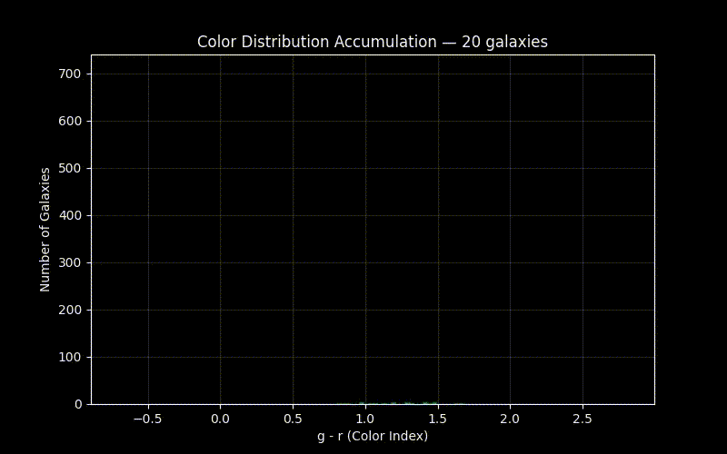
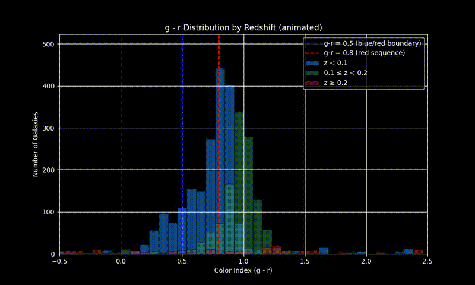
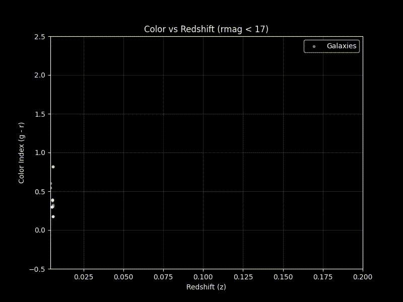

# 🌌 Galaxy Group Analysis & Visualization  
### Hickson Compact Groups (HCG Sample)

This repository contains a collection of Python scripts for retrieving, processing, and visualizing astronomical data from the VizieR catalog.

The project focuses on galaxies in **Hickson Compact Groups (HCGs)** and demonstrates how real observational data can be transformed into clear, engaging visualizations — including animated plots for outreach.

---

## 📡 Data Source

- **Catalog:** J/A+A/691/A6 (Tables A1 & A2)  
- **Provider:** VizieR (`astroquery.vizier`)  
- **Content:** Photometric & spectroscopic galaxy properties  
  - SDSS magnitudes (g, r)  
  - Spectroscopic redshifts  
  - Compact group membership  

---

## 🧩 Project Structure

The repository is organized as a sequence of scripts, each focusing on a specific analysis or visualization task.

---

## 🔬 Scripts Overview

### 1. Basic Catalog Loading
- Loads VizieR tables into Pandas DataFrames  
- Displays sample rows and column structure  

**Purpose:**  
Initial exploration of dataset structure

---

### 2. Galaxy Redshift Distribution
- Extracts redshift (`z`) from Table A1  
- Cleans missing values  
- Plots histogram  

**Goal:**  
Understand distribution of galaxy distances

---

### 3. Color Index Distribution
- Uses Table A2 (`gmag`, `rmag`)  
- Computes color index: `g - r`  
- Plots histogram  

**Goal:**  
Identify blue vs. red galaxy populations

---

### 4. Color vs Redshift Scatter
- Filters valid (`g`, `r`, `z`) entries  
- Computes `g - r`  
- Plots scatter diagram  

**Goal:**  
Explore galaxy color evolution with redshift

---

### 5. g − r Distribution by Redshift Bins
- Splits galaxies into redshift intervals  
- Overlays histograms  
- Adds classification thresholds:
  - `g - r = 0.5` → blue/red boundary  
  - `g - r = 0.8` → red sequence  

**Goal:**  
Compare galaxy populations across cosmic time

---

### 6. Animated Histogram — Color Accumulation
- Galaxies appear progressively  
- Histogram grows dynamically  

**Goal:**  
Show how statistical distributions emerge

---

### 7. Animated Color Distribution by Redshift
- Uses precomputed histograms  
- Adds small fluctuations (uncertainty simulation)  

**Goal:**  
Create dynamic outreach-friendly visualization

---

### 8. Animated Scatter — Color vs Redshift Growth
- Gradual appearance of galaxies  
- Real-time updating trend (moving average)  

**Goal:**  
Visualize formation of the color–redshift relation

---

## ⚙️ Technologies

- Python 3.10+  
- `astroquery` — VizieR access  
- `pandas` — data processing  
- `numpy` — numerical operations  
- `matplotlib` — plotting & animation  
- `ffmpeg` — video export  

---

## 📊 Example Output

- Redshift histograms  
- Color index distributions  
- Color vs redshift scatter plots  
- Animated visualizations of dataset evolution  

---

## 🎓 Educational Use

This project is suitable for:

- Astronomy / astrophysics students  
- Data analysis learners  
- Science communication & outreach  
- Visualization and storytelling with real data  

---

## 📸 Gallery

### Galaxy Redshift Distribution

### Color Index Distribution

### Color vs Redshift Scatter

### g − r Distribution by Redshift Bins

### Animated Histogram (Color Accumulation)

### Animated Color Distribution by Redshift

### Animated Scatter: Color vs Redshift Growth

---

## 🚀 Notes

This repository emphasizes:
- clarity over complexity  
- reproducible workflows  
- visual intuition in astrophysical data  

---

## 📬 Future Improvements

- Interactive (web-based) visualizations  
- Integration with additional catalogs  
- Extension to larger galaxy samples  