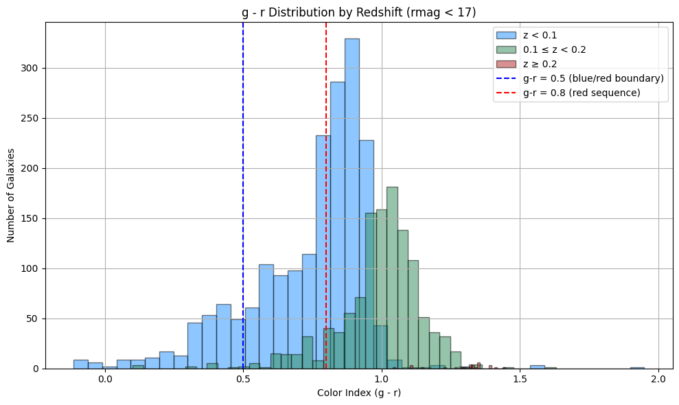

Galaxy Group Analysis & Visualization (HCG Sample)
This repository contains a set of Python scripts for retrieving, processing, and visualizing data from the VizieR catalog
J/A+A/691/A6 — a study of galaxies in Hickson Compact Groups (HCGs).
The scripts demonstrate scientific data analysis and animated visualization techniques for astronomy outreach.

⸻

Data Source
	•	Catalog: J/A+A/691/A6 (Tables A1 & A2)
	•	Provider: VizieR (astroquery.vizier)
	•	Content: Photometric & spectroscopic properties of galaxies in compact groups
(e.g., apparent magnitudes in SDSS g and r bands, spectroscopic redshifts).

⸻

Scripts Overview

1. Basic Catalog Loading
	•	Loads full VizieR tables into Pandas DataFrames.
	•	Displays first rows & column names.
	•	Purpose: familiarization with dataset structure.

⸻

2. Galaxy Redshift Distribution
	•	Reads Table A1, identifies the redshift column, cleans NaNs.
	•	Plots a histogram of galaxy redshifts.
	•	Goal: show the spread of galaxy distances in the sample.

⸻

3. Color Index Distribution
	•	Uses Table A2 (gmag, rmag).
	•	Computes color index: g - r.
	•	Plots a histogram of color values.
	•	Goal: reveal blue vs. red galaxy populations.

⸻

4. Color vs Redshift Scatter
	•	Filters galaxies with valid gmag, rmag, and z.
	•	Computes g - r color index.
	•	Plots a scatter diagram of color vs. redshift.
	•	Goal: explore galaxy color evolution with cosmic time.

⸻

5. g − r Distribution by Redshift Bins
	•	Divides galaxies into three redshift ranges.
	•	Plots overlaid histograms with classification lines at:
	•	g - r = 0.5 (blue/red boundary)
	•	g - r = 0.8 (red sequence)
	•	Goal: compare color distributions at different epochs.

⸻

6. Animated Histogram (Color Accumulation)
	•	Galaxies appear gradually in g - r histogram.
	•	Bars grow as more galaxies are added.
	•	Goal: visually demonstrate how sample statistics build up.

⸻

7. Animated Color Distribution by Redshift
	•	Uses precomputed histograms for each redshift bin.
	•	Randomly fluctuates bar heights to simulate observational uncertainty.
	•	Goal: dynamic, engaging outreach illustration.

⸻

8. Animated Scatter: Color vs. Redshift Growth
	•	Galaxies appear gradually in z vs. g − r plot.
	•	Moving average line (binned in z) updates in real time.
	•	Goal: show the buildup of the observed galaxy color–redshift relation.

⸻

Technologies Used
	•	Python (3.10+)
	•	astroquery — for VizieR catalog queries
	•	pandas — for data manipulation
	•	matplotlib — for static plots & animations
	•	numpy — for numerical operations
	•	ffmpeg — for saving animations as MP4

⸻

Example Output
	•	Histograms: redshift, color index, color by redshift bin.
	•	Scatter plots: galaxy color evolution.
	•	Animations: stepwise build-up of data, real-time updating trends.

⸻

Educational Use

These scripts are designed for:
	•	Astronomy & astrophysics students.
	•	Science communicators & outreach projects.
	•	Anyone learning to combine real astronomical data with visual storytelling.

⸻

📸 Gallery

1. Galaxy Redshift Distribution

2. Color Index Distribution

3. Color vs Redshift Scatter

4. g − r Distribution by Redshift Bins

5. Animated Histogram (Color Accumulation)

6. Animated Color Distribution by Redshift

7. Animated Scatter: Color vs. Redshift Growth  
